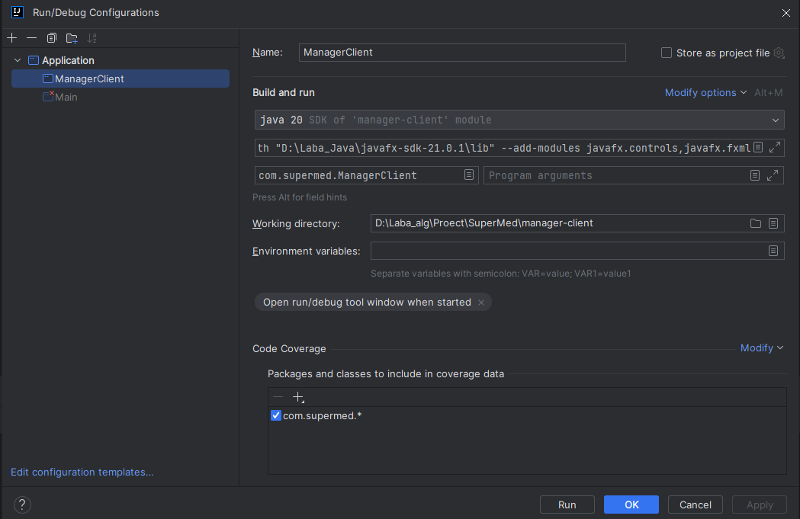
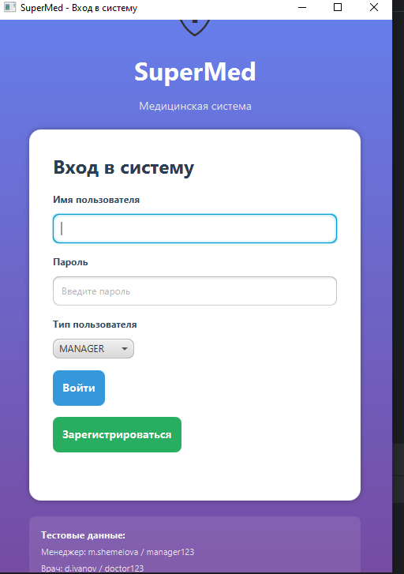
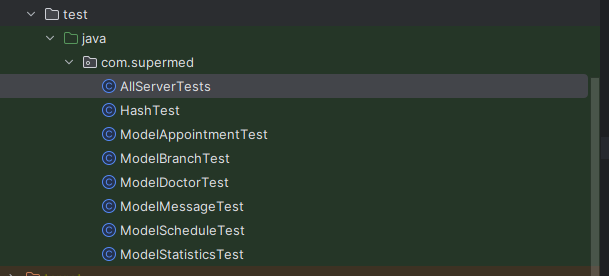
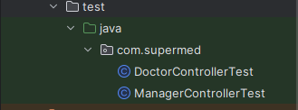

# SuperMed

Ссылка: https://drive.google.com/drive/folders/1J7zxVv32QNCsdRdEYgtj_erHAJFFJEaY?usp=sharing

## Как запустить проект (сервер и клиента менеджера)

1. Клонируйте репозиторий

```sh
git clone https://github.com/dasha1112/SuperMed.git
```

2. Откройте в Intelli IDEA папку supermed-server и запустите сервер с помощью файла Main (кликните на файл Main правой кнопкой мыши и в всплывшем окне выберите Run Main.main())
Если все запуститлось корректно, то в терминале должно вывести следующее:
```
SLF4J: Failed to load class "org.slf4j.impl.StaticLoggerBinder".
SLF4J: Defaulting to no-operation (NOP) logger implementation
SLF4J: See http://www.slf4j.org/codes.html#StaticLoggerBinder for further details.
База данных инициализирована успешно.
Сервер SuperMed запущен на http://localhost:4567
```

3. Далее, в новом окне Intelli IDEA откройте папку manager-client и настройте конфигурацию для MainClient следующим обраом:
* В верхнем меню выберите Run → Edit Configurations...
* Найдите конфигурацию для MainClient (или создайте новую)
* В поле VM options добавьте:
```sh
--module-path "C:\path\to\javafx-sdk-17.0.6\lib" --add-modules javafx.controls,javafx.fxml
```

Пример как это должно выглядеть:


Также проверьте есть ли у вас все зависимости указанные в файле pom.xml . Если каких-то нет, то необходимо будет их доустановить. Если у вас возникла следующая ошибка:
```
Error: JavaFX runtime components are missing, and are required to run this application
```
то вы неправильно настроили конфигурацию или недоустановили некоторые пакеты, поэтому удостоверьтесь, что выполнили выше описанные шаги корректно.

Если все заработало корректно, то у вас должно появиться окно входа, которое выглядит следующим образом:


Далее необходимо ввести тестовые данные для менеджера (m.shemelova, manager123) и в клиента менеджера.

## Описание запуска клиента врача

Запуск аналогичен запуску менеджера, только в окне входа необходимо ввести тестовые данные для врача (d.ivanov, doctor123)

## Описание запуска android клиента пациента

Для запуска необходимо установить эмулятор андроида (Android studio), сбилдить проект и запустить его. Тестовые данные для пациента: p.kotova patient123

## Описание запуска тестов для сервера

Тесты для сервера имеют следующую структуру:



Для их запуска необходимо выбрать в качестве запускаемого файла AllServerTests и отредактировать его конфигураци. Для этого перейдите в раздел Run → Edit Configurations и добавьте новую конфигурацию типа JUnit и в качестве запускаемого класса выберете com.supermed.AllServerTests. Далее в поле VM options добавьте:

```
--add-opens java.base/java.lang=ALL-UNNAMED --add-opens java.base/java.lang.reflect=ALL-UNNAMED --add-opens java.base/java.util=ALL-UNNAMED --add-opens java.base/java.util.concurrent=ALL-UNNAMED --add-opens java.base/java.io=ALL-UNNAMED --add-opens java.sql/java.sql=ALL-UNNAMED -Dnet.bytebuddy.experimental=true
```

Ваша конфигурация должна выглядеть следующим образом:


Если все запущено корректно, то все тесты пройдут успешно:


## Описание запуска тестов для клиентов менеджера и доктора

Тесты находятся в папку manager-client и имеют следующую структуру:



Для их запуска не нужны дополнительные зависимости или параметры, достаточно свыполнить Run
